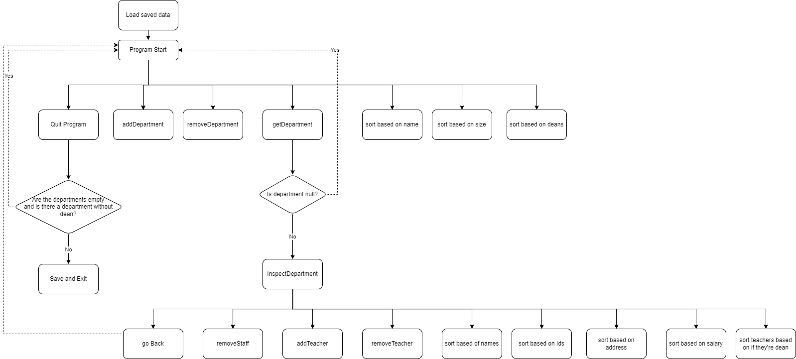
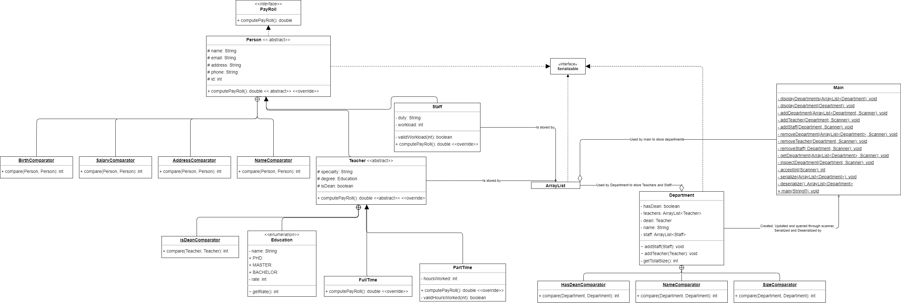
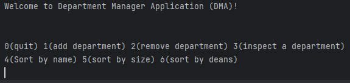
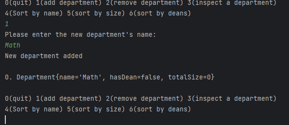
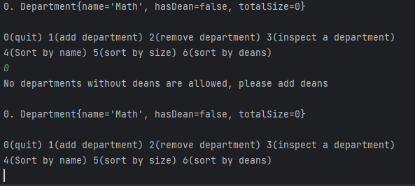
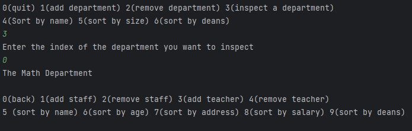
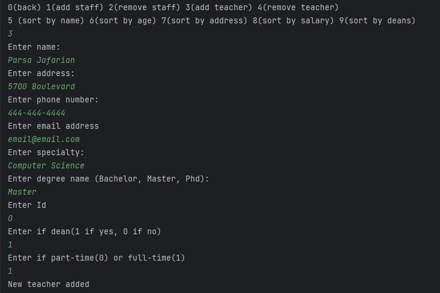
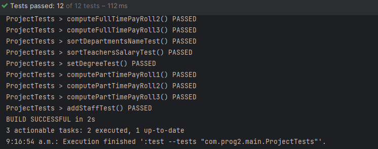

# Data Structures & OOP Project Documentation
## Introduction
This is my java project in my second semester of cégep at Vanier, Montreal Qc. It assesses my competencies in Java, data structures and algorithms and OOP. The goal of the project is to create a program that manages a college's departments and employees. The program is run through the console and uses serialization to save data. The program is structured in a way that allows the user to implement all CRUD(Create, Read, Update, Delete) functionalities. The data structure part of the course comes in with the decision of choosing which data structure to store the employees and departments. In this project, arraylist was chosen for its simple sorting with comparators. The Object oriented programming  of this course was implemented by creating the right class hierarchy and relationships to ensure an error-free program. The program is also tested to ensure its stability

### Application Structure
**Input Map**

This application serves as a way to manage your college's departments and employees through console commands.
There are two layers of inputs from the end user.
The first layer of input involves adding ,removing,querying and sorting departments.
The second layer of input involves adding, removing and sorting employees (Teacher or Staff) of a given Department.

Input Map of application

**Classes**

Each department contains instances of  the classes of Teacher and Staff, both of which are extended from Person.
The application everything through departments alone. The only object directly created, loaded and saved is an arraylist
of departments. More on that later.

Here is the UML diagram of this program: 

The Person class and its children classes define the employees inside the department. Each person has 5 common
attributes, but then they differ when they are split into their collective subclasses. The main difference between
each subclass is their difference of salary that is calculated through the abstract method of computePayRoll() which 
is implemented from the PayRoll interface.

The inner classes are mostly comparators within each class with the help
of sorting arraylists of their corresponding outer classes in the main method.
The only exception is the Enum Education which helps set the degree of a teacher.

The interfaces used are only PayRoll and Serializable. Payroll helps implement classes
to calculate the class' salary while serializable helps the main method to save all data 
after program is exited. Moreover, it helps main to load data as well.

**Serialization and Deserialization**

The program should load previous data when started and should save new data when exited.
Thus, the serialize() and deserialize() methods are used in the main method. The only object that is 
serialized and deserialized is the instance of an arraylist of departments. It is so because 
this arraylist encompasses all instantiated classes. This list contains departments. Each department then contains Staff
and teachers. So all classes are saved in the text file at the end through only the arraylist.

**Main Class**

The main method uses a scanner a lot because of console user input. All the methods inside the Main class are static
and private. They're static because they are used within the class, and they're private because they're only used within
that class. All of these methods serve as functions that abbreviate the code inside the main method. Thus, most of 
them are void and all of them except serialize() and deserialize() use the scanner declared inside main as parameter.

### User Input Overview

As previously said, the first layer of input involves the departments.
After the program starts running for the first time , the user will see the following in the console:

The program uses integers in order to minimize user error handling. As there are no departments 
for now, let's add a department. 

We type the number 1 to add a department, and we add the Math department.
Now let's exit the program

The program doesn't let the user exit because although a department was added 
there is no dean assigned to it. So let's add the dean.

3 is typed in order to inspect a department and this opens the path to the second layer of input.
The user can now modify the chosen department. Let's now add a teacher because a dean must be added.

The user is asked to input all of a teacher's characteristics. After the dean teacher was successfully added
, the user can now go back to the first menu of choices and quit the program.

This was a quick rundown of how to navigate the UI.

**Display**

In order to display a department, the list of teachers within that department are first printed with the help of their 
toString() methods. Then, the department's lift of staff is also printed in the same manner. Departments are also 
displayed through their toString() method.

**Errors and Restrictions**

The user cannot leave the program as long as a department without a dean exists.
Moreover, an employee with the same id as another employee inside a department cannot be added and an exception is thrown.
No error handling for String attributes(such as name, address,etc.) other than degree exist for employees and thus gibberish can be added.
For some employees, workHours must be set and these are only restricted from 0 to 40 hours. No two departments with
the same name can exist and a runtime exception will be thrown and handled.

### Tests
Some functional methods have been tested to verify the program's stability.
These tests are:
1. computePayRoll tests to see if salaries are correctly calculated
2. Sorting Departments by name test to see if sorting algorithms based on comparators work
3. Sorting Teachers by salary test to see if the calculations work in sorting a list
4. Adding an existing teacher to a department to check if the exception is rightly thrown 
5. Setting degree in order to check if the teacher has a null Education degree

All tests have passed:

### Program Effectiveness and Conclusion ###
The program works as intended , it enables the user to add new teachers, staff and departments and allows
them to save their data and load it up when the application is reused. It has a concise UI that displays each
Department, Staff and Teacher and all the commands associated with them. However, the program has some areas 
to improve. Here are the following inefficiencies:

1. The iterative speed of O is not truly taken into account. Better data structures could have used other than 
arraylists, but they would not have provided more effective sorting algorithms than List.sort(Comparator). 
Because of this, the search(int index) and remove(int index) of the arrayLists use O(n). Still O(n) is not so bad for this

2. Although employees can be created just fine, they cannot truly be updated alone. In order to update an existing
employee, the user must first remove the employee they want to change and add them back with different parameters.
This could be easily fixed with a new layer of inputs in the scanner but that would make the main method bulky because
it would be running three loops that are not easily organized as code. 

3. Some attributes of the employees can be inputted as complete gibberish as they are not checked. For example
a user could write a name of "asdlkfj;asldk" and the program would still assign that name value to the corresponding
added employee. This could be fixed by regex and Natural language processing libraries but that's beyond the scope
of this project.

4. There are many over reliance on loops with the scanner inputs. For example, in order to check if an integer is
right, it must first go through the loop of acceptInt(Scanner scanner) method in Main class and then through another
while loop to check if the integer is in the right range. That would theoretically make it O(n^2) but I believe 
that it doesn't change anything because the amount of times the loops can be repeated depends on the user. Thus, 
the user will bring the O close to constant time.

### Conclusion ###
The program delivers all the user's needs. It allows the user to manage each department of their school. 
They can add and remove departments while also being able to sort them in different ways. They can also add
and remove employees while implementing different sorting algorithms in order to organize all personnel. This is
achieved through the use of objected oriented programming and data structures. The employees were organized in 
classes that were extended from the Person class. Each of these employees were then stored in the data structure 
of arraylist in departments. Finally , the main method also used an arraylist of departments. The course's 
teachings has been successfully implemented. However, more could have been improved such as GUI but that would be 
seen later.

